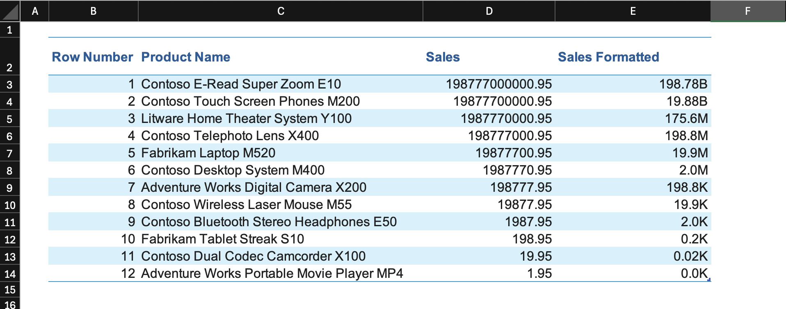
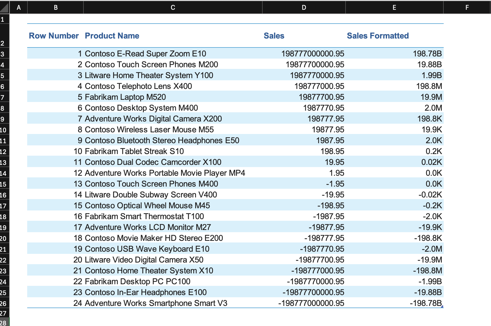
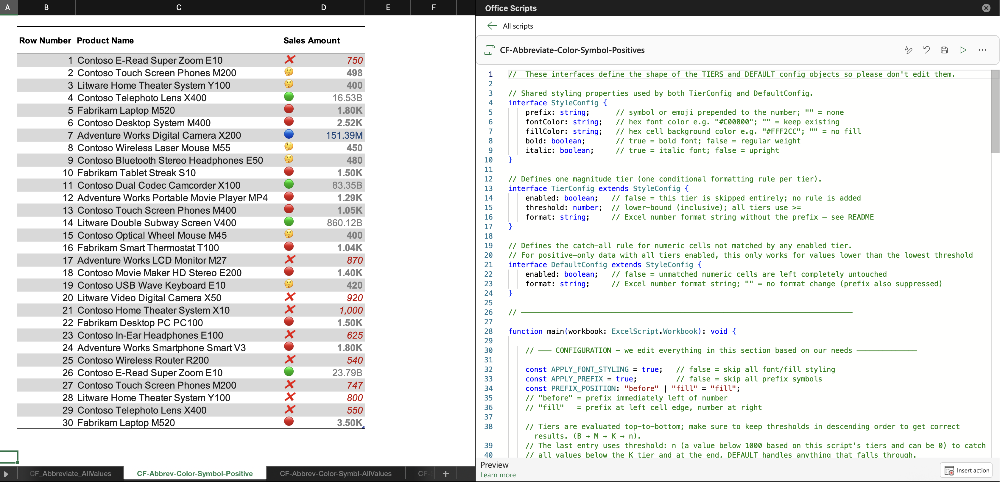
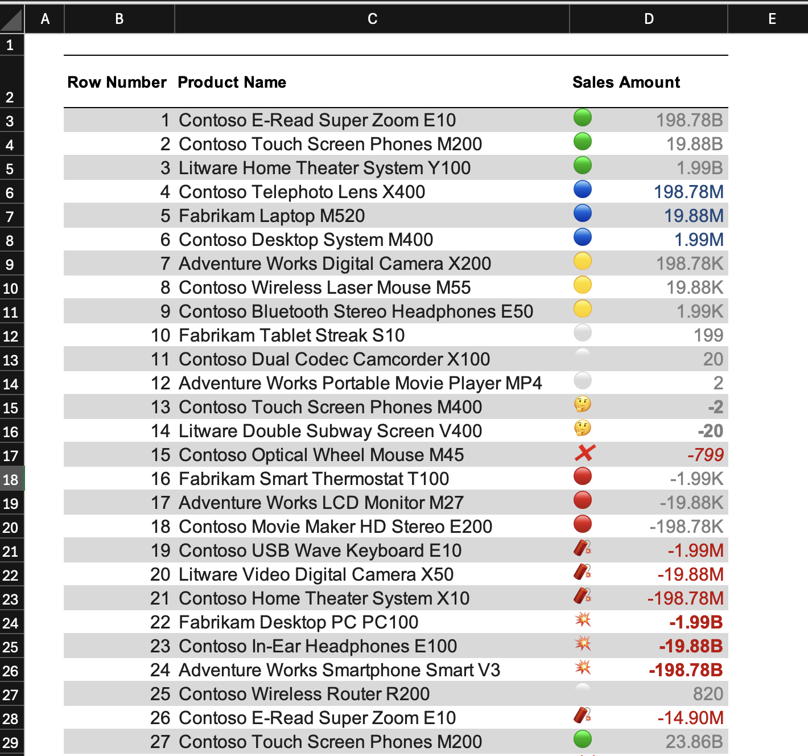
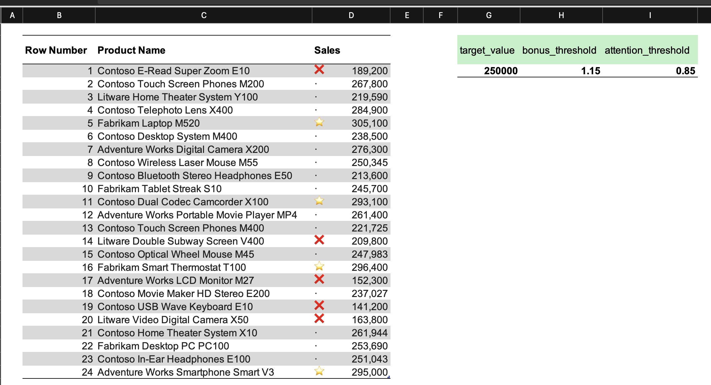

# Conditional Formatting Scripts

I've created five Office Scripts that apply conditional formatting rules to a selected range. They follow a logical progression: the first two cover basic K/M/B number abbreviation, the next two add color, prefix symbols, and styling, and the last one is a different concept entirely, using named cells in the workbook to drive performance-relative thresholds.

> **A note on the formatting in this file:** The rules applied to each sheet use different combinations of emojis, colors, and styling to show what the scripts are capable of, not to demonstrate good formatting practice. In a real dashboard or report, the goal is to reduce cognitive load so the reader can understand the data at a glance. That means two or three formatting variants at most, consistent decimal behavior across tiers, and no colors or symbols unless a specific value really needs attention. The examples here go further than that deliberately so the configuration options are visible.

> **Office Scripts requirement:** These scripts require a Microsoft 365 subscription. 
> Scripts are stored in OneDrive under `Documents/Office Scripts/` as `.osts` files and are not embedded inside the workbook. 
> To use the scripts in this repo, download the `.osts` files or copy the `.osts` file contents from the `scripts/` folder and then open Excel on your laptop, navigate to the Automate tab, click New Script, then click Create in Code Editor option and clear the editor first and then paste the script and lastly give it a proper name, and save it.

**To run any script:** select the range you want to format, open the Scripts pane via **Automate → Code Editor**, and click Run. All five scripts read `workbook.getSelectedRange()`, so there is no hardcoded range.

---

## Behaviors shared by all scripts

Three behaviors apply to every script in this file and are worth understanding before reading the individual sections.

**`clearAllConditionalFormats()` runs at the start of every script.** This wipes any existing CF rules from the selection before applying new ones, so running the script twice on the same range does not stack duplicate rules.

**`addConditionalFormat()` appends to the bottom of the priority stack.** Excel evaluates CF rules from top (priority 1) downward, so the rule added first in the script ends up with the highest priority. This means tiers must be added in descending threshold order: B first, then M, then K. If K were added first, a value of 5B would be caught by the K rule before B ever gets evaluated.

**`setStopIfTrue(true)` is applied to every tier rule.** Once a cell matches a rule, Excel skips all remaining lower-priority rules for that cell. Without this, a value of 5B would match the B rule and then continue evaluating M and K as well.


### Comments in scripts

I also left comment lines inside each script that can help you understand what each part of the code does.

---

## Script 1: CF_Abbreviate_PositiveOnly

**Sheet: CF_Abbreviate_PositiveOnly**



The simplest script. It applies four tiers of K/M/B number abbreviation to a selected range using custom CF formulas, and it only targets positive values in nature. you should not use it for negative numbers because they fall through all rules and keep whatever format the cell already has.

Each rule uses a custom formula type with a `>=` comparison against the tier threshold. The last tier has a threshold of 0, so it catches all positive values below 1,000 and still displays them in K format (0.02K, 0.00K, and so on).

---

## Script 2: CF_Abbreviate_AllValues

**Sheet: CF_Abbreviate_AllValues**



Identical to Script 1 in structure, with one change: each formula wraps the cell reference in `ABS()`. This means one rule per tier handles both positive and negative values of the same magnitude. Without ABS(), a value of -2B would not satisfy `=E3>=1000000000` and would fall through to the cell default.

The format strings are single-section, so Excel preserves the minus sign on negative values. -198,777,000,000 is scaled by three trailing commas to -198.78, and the B suffix is appended by the format string, producing -198.78B.

---

## Script 3: CF-Abbrev-Color-Symbol-Positive

**Sheet: CF-Abbrev-Color-Symbol-Positive**



I wanted this script to have a configuration object pattern so that you can adjust it based on your needs easier, because the script is longer than the previous ones. 

Instead of hardcoding thresholds and formats directly in the loop, each tier is defined as an object with fields for threshold, format string, prefix symbol, font color, fill color, bold, and italic. The script loop reads these objects and builds the rules, so adjusting the formatting only requires editing the config section at the top.

### cellValue type instead of custom formula

Scripts 1 and 2 use the `custom` formula type and build the comparison as a formula string (`=E3>=1000000000`). This script switches to the `cellValue` type with `greaterThanOrEqual` as the operator, passing the threshold directly as `formula1`. The result in the Manage Rules dialog is "Cell Value >= 1000000000" instead of "Formula: =E3>=...". Both approaches work, but the cellValue type is cleaner for simple threshold comparisons because Excel owns the formula construction.

This script targets positive values only, the same as Script 1.

### Prefix symbols and PREFIX_POSITION

Each tier can have a prefix (an emoji or any text symbol) prepended to the displayed number. `PREFIX_POSITION` controls the layout:

- `"before"` places the prefix immediately to the left of the number: `🟢 198.78B`
- `"fill"` pins the prefix to the left edge of the cell and right-aligns the number using Excel's fill character (`*`), so the prefix sits on the far left and the number on the far right

The `buildFormat()` function combines the base format string with the prefix to produce the Excel custom format string passed to `setNumberFormat()`.

### The DEFAULT rule

After all tier rules are added, a catch-all DEFAULT rule targets any numeric cell not matched by a tier. It uses the custom formula `=ISNUMBER(anchor)` so it fires only on cells containing numbers and leaves text cells untouched. DEFAULT is the last rule and has no `setStopIfTrue` requirement.

Two global flags at the top of the config control the whole script: `APPLY_FONT_STYLING` (when false, skips all font color, fill color, bold, and italic changes across every tier) and `APPLY_PREFIX` (when false, omits the prefix symbol from all format strings).

---

## Script 4: CF-Abbrev-Color-Symbl-AllValues

**Sheet: CF-Abbrev-Color-Symbl-AllValues**



This extends Script 3 to handle negative values. Instead of a single `TIERS` array, there are two: `POSITIVE_TIERS` (using `greaterThanOrEqual`) and `NEGATIVE_TIERS` (using `lessThanOrEqual`). A shared `applyTiers()` function processes both, passing the appropriate operator each time, so the tier loop is written once.

### Threshold ordering for negative tiers

Positive tiers go from largest to smallest (B → M → K → n) so the B rule is added first and gets the highest priority. Negative tiers follow the same logic in the opposite direction: most negative first (-B → -M → -K → -n). The -B rule must win for a value like -2B before the -M rule evaluates it, so it has to be added first.

### The two-section format string

In Scripts 1 to 3, each format string has a single section. When a single-section format is applied to a negative number, Excel prepends the minus sign to the entire formatted value including the prefix, producing something like `-🟢 198.78B` if you have used symbols or emojis. The prefix is inside the minus sign, which looks wrong.

Script 4's `buildFormat()` generates a two-section format string: the first section for positive values, the second for negative. The negative section includes a literal `-` so the sign is part of the scaling expression, not added by Excel outside the format. The result for a -B value with prefix "💥" is `"💥 "* 0.00,,,"B";"💥 "* -0.00,,,"B"`, which displays as `💥 -198.78B`.

### What DEFAULT catches

In the example config, positive tiers cover values `>= 0` and negative tiers cover values `<= -500`. Values between -499 and -1 are not matched by any tier and fall to DEFAULT.
You can easily change this range based on your needs.

---

## Script 5: CF-Symbol-Target-Thresholds

**Sheet: CF-Symbol-Target-Thresholds**



I cretaed this script to show that **we can use target cells** in our conditional formatting scripts as well, and we are not limited to only hardcoded values.

This script applies performance-relative formatting based on three named cells defined in the workbook: `target_value` (the benchmark), `bonus_threshold` (a multiplier above target, e.g. 1.15), and `attention_threshold` (a multiplier below target, e.g. 0.85). 

The CF formulas reference these named cells directly, so changing their values in the sheet updates the thresholds for every formatted cell **without the need to running the script again**.

### Named range validation

Before touching any formatting, the script checks that all three named ranges exist in the workbook and aborts with a console message if any is missing. Without this check, a missing name would produce silent `#NAME?` errors in the CF formulas and format nothing.

### The formulaTemplate pattern

Each rule in the `RULES` array has a `formulaTemplate` field with `{A}` as a placeholder for the anchor cell. At runtime the script replaces every `{A}` with the actual top-left cell address of the selection (e.g. `D3`) before writing the formula to the rule. This keeps the template readable in the config and produces the correct relative reference for Excel to shift across the range.

The "normal" rule uses an AND formula that checks whether the cell value falls strictly between the two thresholds:

```
=AND(D3>attention_threshold*target_value,D3<bonus_threshold*target_value)
```

### Rule ordering

The `RULES` array puts "normal" first. That was done on purpose, because on a typical dataset, most values fall within the normal range, so with `StopIfTrue: true`, those cells match the first rule and skip the bonus and attention evaluations entirely. This is the cheapest path through the rule stack. Bonus and attention rules only fire for the minority of cells that fall outside the normal band.

### Adding a new tier

To add a tier below attention (a "critical" zone, for example): add a named multiplier in Excel's Name Manager, add a new entry to the `RULES` array in the appropriate position, and update the "attention" rule's `formulaTemplate` to use AND so it excludes the critical range. Without that update, "attention" would match both the attention band and the critical zone.
