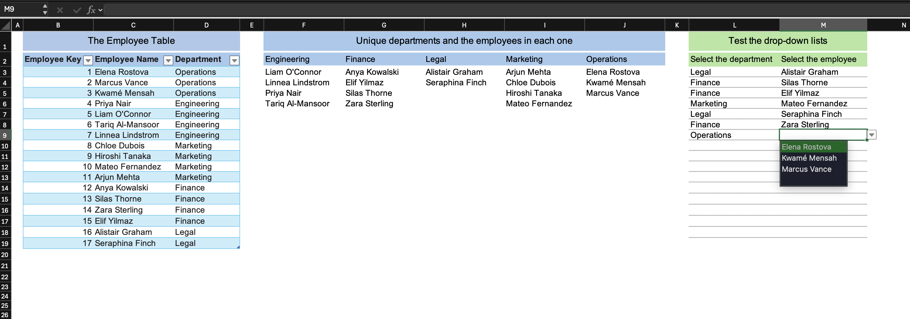
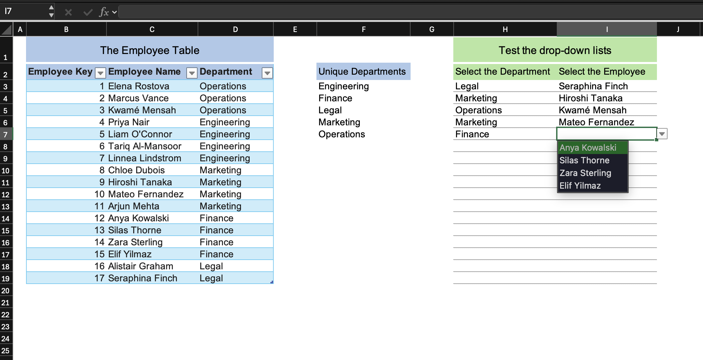
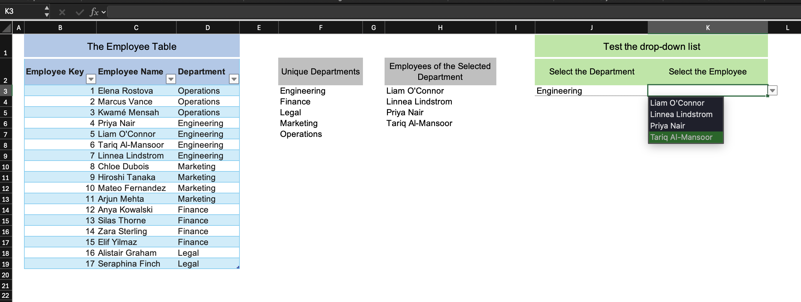

# Dependent Dropdown Lists in Excel

Here I'll show three approaches to building dependent (cascading) dropdown lists in Excel, where selecting a value in a first dropdown filters the options in a second dropdown. Each sheet in the workbook implements the same employee-department scenario using a different technique, and at the end there is a comparison of all three.

> **Layout note:** In this workbook the source data table, intermediate calculations, and the dropdown test area sit side by side on the same sheet for clarity. In a real workbook you would keep these on separate sheets and reference them across.

---

## Approach 1 — Pre-computed Columns with FILTER and XLOOKUP

**Sheet: Multirow - Xlookup 1**



### Concept

The idea is to build a separate column of employees for every department ahead of time, then at runtime use XLOOKUP to pick whichever column matches the selected department. The department names are spread horizontally so each one becomes the header of its own employee column.

### Step 1 — Extract Unique Departments (Horizontal)

```excel
=TRANSPOSE(SORT(UNIQUE(EmployeeTbl1[Department])))
```

UNIQUE extracts the distinct department names, SORT alphabetizes them, and TRANSPOSE spills the result horizontally across a row rather than downward. This row serves two purposes: it is the header above each employee column, and it is the lookup array for the dependent dropdown formula.

### Step 2 — Filter Employees per Department

Below each department header, a FILTER formula retrieves only the employees for that department:

```excel
=SORT(FILTER(EmployeeTbl1[[Employee Name]:[Employee Name]],
EmployeeTbl1[[Department]:[Department]] = F2))
```

- The first argument is the column of names to return.
- The second argument is the filter condition — keep only rows where the Department column matches the header above (`F2`, `G2`, `H2`, and so on).
- SORT alphabetizes the result.

This formula has to be entered once per department column, with the header cell reference updated for each one. If a new department is added later, a new column and a new formula have to be added manually.

### Step 3 — Department Dropdown

The department dropdown's Data Validation source points to the spilled range from the TRANSPOSE formula:

```
=$F$2#
```

The `#` (spill range operator) makes the reference dynamic, so it expands automatically to cover however many departments the formula returned.

### Step 4 — Dependent Employee Dropdown

The employee dropdown's Data Validation source uses XLOOKUP to return the employee column that belongs to the selected department:

```excel
=XLOOKUP(L3, $F$2:$J$2, $F$3:$J$19, $F$3:$J$19)
```

- `L3` is the selected department (the department dropdown cell).
- `$F$2:$J$2` is the horizontal row of department headers.
- `$F$3:$J$19` is the full grid of pre-computed employee names below those headers.
- The fourth argument (`$F$3:$J$19`) is the fallback if no match is found.

When the return array is a multi-column range, XLOOKUP returns the entire matched column, so the employee list for the selected department comes back as a single column ready for the dropdown.

### What are the downsides?

**Blank rows appear in the dropdown.** The return range covers all rows down to the maximum employee count across all departments, so departments with fewer employees produce blank entries at the bottom of the list. This is visible in the screenshot above.

**Manual upkeep when departments change.** Adding a new department means adding a new FILTER formula column and updating the range references in the dependent dropdown's Data Validation formula.

---

## Approach 2 — XLOOKUP Paired Range in a Named Formula

**Sheet: Multirow - Xlookup 2**



### Concept

Instead of pre-computing a separate column for every department, here we define a single Named Formula that builds a range spanning exactly the employees for the selected department. So no blanks, no manual column upkeep. The trick is that XLOOKUP, unlike most functions, returns the actual cell it found in the source table rather than a computed value. Because of this, we can place two XLOOKUP calls on either side of Excel's range operator (`:`) to build a live range from the first matching row to the last.

### Step 1 — Extract Unique Departments (Vertical)

```excel
=SORT(UNIQUE(EmployeeTbl2[Department]))
```

This spills department names downward into a column, which becomes the source for the department dropdown.

### Step 2 — Define the Named Formula

**Before opening Name Manager, click the cell that will be the first employee dropdown cell** — the topmost cell in the column where the dependent dropdowns will appear. This matters because the formula uses a relative reference to the department cell in the same row, and Excel captures that reference relative to whichever cell is active at the moment the name is defined.

Go to **Formulas → Name Manager → New**, give the name a label (for example, `Employees`), and enter:

```excel
=
XLOOKUP('Multirow - Xlookup 2'!H3, EmployeeTbl2[Department],
EmployeeTbl2[Employee Name]) 
: 
XLOOKUP('Multirow - Xlookup 2'!H3, EmployeeTbl2[Department],
EmployeeTbl2[Employee Name], , , -1)
```

The first XLOOKUP finds the first row where Department matches `H3` (the selected department) and returns the corresponding Employee Name cell. The default search mode scans top to bottom. The second XLOOKUP does the same thing but with the sixth argument (search mode) set to `-1`, which scans bottom to top and so finds the last occurrence. The `:` between them constructs a contiguous range from that first row to the last.

**Why not FILTER?** FILTER produces an array of computed values, not references back into the source table, so the range operator has nothing to anchor to. XLOOKUP is what makes this pattern work because it returns the actual cell it matched, not just the value.

**The source data must be grouped by department.** This only produces correct results when all employees for a given department are contiguous in the table. If the data were unsorted, the range between the first and last match would span multiple departments and return wrong names.

### Step 3 — Apply Data Validation

In the employee dropdown cells, set the Data Validation source to:

```
=Employees
```

Because `H3` in the named formula is a relative reference (not `$H$3`), Excel adjusts it row by row as the validation is applied down the column, so each row's dropdown automatically references the department selected in that same row.

### Advantages over Approach 1

No blank rows appear in the employee dropdown. No per-department helper formulas to maintain. Adding new employees or departments to the source table requires no changes to the dropdown setup.

---

## Approach 3 — Dynamic FILTER (Single-Row Dropdowns Only)

**Sheet: Single Row - Filter**



### Concept

The simplest of the three. A helper formula recalculates the eligible employee list whenever the department selection changes, and the employee dropdown reads from that spilled result. There are no named formula tricks and the filtering is completely transparent. The trade-off is that this design is built for a single pair of dropdowns and doesn't scale to a table where each row needs its own independent selection.

### Step 1 — Extract Unique Departments

```excel
=SORT(UNIQUE(EmployeeTbl3[Department]))
```

Same as Approach 2 — spills department names downward.

### Step 2 — Department Dropdown

The department dropdown's Data Validation source points to the spilled range:

```
=$F$3#
```

### Step 3 — Filter Employees Dynamically

A helper formula in the worksheet filters the employee list based on the currently selected department:

```excel
=SORT(FILTER(EmployeeTbl3[Employee Name], EmployeeTbl3[Department] = K3, "No Department Selected"))
```

- `EmployeeTbl3[Employee Name]` is the full column of names to filter.
- `EmployeeTbl3[Department] = K3` keeps only the rows where the department matches `K3`, the department dropdown cell.
- `"No Department Selected"` is returned if `K3` is empty or has no match.

This formula spills its results into adjacent cells and updates automatically whenever `K3` changes.

### Step 4 — Employee Dropdown

The employee dropdown's Data Validation source points to the spilled range from the FILTER formula (adjust the cell reference to wherever the FILTER formula is placed):

```
=$H$3#
```

### What is the limitation?

This works for one department selector paired with one employee selector. If multiple independent rows are needed, each with its own department and employee selection, then we should use Approach 1 or Approach 2 instead.

---

## Comparison

| | Approach 1 | Approach 2 | Approach 3 |
|---|---|---|---|
| Supports multiple independent rows | Yes | Yes | No |
| Blank rows in dropdown | Yes | No | No |
| Source data must be grouped by department | No | Yes | No |
| Work required when departments are added | New column + range update | None | None |
| Setup complexity | Low | Medium | Low |
