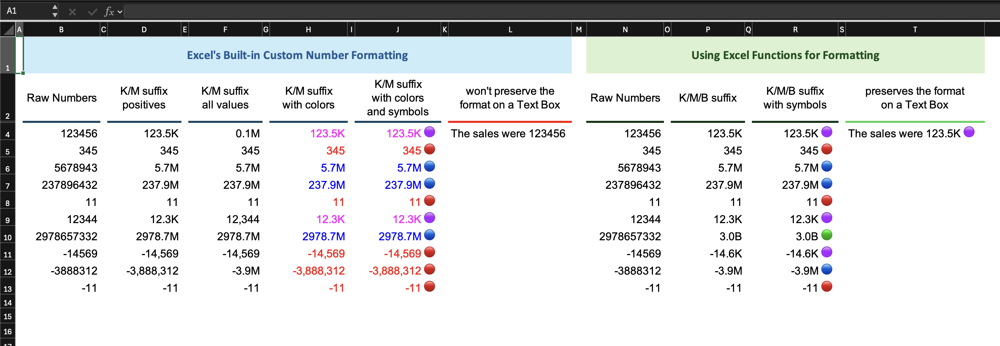

# Number Formatting in Excel

Two distinct approaches for custom number formatting in Excel: the built-in custom number format through the Format Cells dialog, and formula-generated text using `TEXT()` and `LET()`. I have put both of them side by side, and created from basic magnitude abbreviation till colors and symbols, so you can see exactly what each approach can and can't do and where each one breaks down.

> **One thing to say up front:** the formatting in this workbook is intentionally over-done. Multiple colors, emoji symbols, and magnitude suffixes all at once would overwhelm anyone reading a real dashboard or report. The whole point of formatting in that context is to reduce cognitive load and to let people understand a number at a glance without having to decode it. These columns exist to show what's *possible*, not to suggest this is how production formatting should look.



---


## The two-condition limit

Before getting into each column, there is a constraint in Excel's custom number formatting that shapes everything on the left side of this workbook.

A custom number format supports up to three sections, separated by semicolons:

```
[condition1] format1 ; [condition2] format2 ; else_format
```

Excel evaluates them left to right. If the value matches `condition1`, it applies `format1` and stops. If it doesn't match, Excel checks `condition2`. If neither matches, the third section, which has no condition of its own, catches everything that's left.

The idea is that **only two explicit conditions are supported**. The third section is always an unconditional else. This means:

- You can differentiate between K and M, but not K, M, and B because that needs three conditions.
- If you use both condition slots for positive and negative abbreviation, there's no room left for a secondary magnitude tier.

This constraint is exactly why the formula-based section on the right side of the workbook exists.

---

## Left section: Custom Number Formatting

### K/M suffix — positives

**Format string:**
```
[>=1000000]0.0,,"M";[>=1000]0.0,"K";#,##0
```

The two condition slots target millions and thousands. Anything below 1,000  including all negative numbers, falls into the else section and gets standard comma formatting (`#,##0`).

The trick with the commas after the digit code: in a custom number format, a `,` placed after the digit section acts as a *scale divider*, not a thousands separator. Each `,` divides the displayed value by 1,000 without showing the separator character. So `0.0,,` divides by 1,000,000 and shows one decimal place, giving you millions. `0.0,` divides by 1,000, giving you thousands.

### K/M suffix — all values

**Format string:**
```
[>=100000]0.0,,"M";[<=-100000]-0.0,,"M";#,##0
```

Using both condition slots for positive and negative abbreviation means there's no room for a K tier so the threshold is set at 100,000 instead of 1,000,000. Values between -100,000 and 100,000 fall into the else and display with plain comma formatting.

The explicit `-` at the start of the second format code (`-0.0,,"M"`) is a literal minus sign. In condition-based format sections, the digit codes work on the absolute value of the matched number, so without the leading `-`, a value like -3,888,312 would display as `3.9M` instead of `-3.9M`.

Note also what you're trading away here: there's no K tier. 12,344 shows as `12,344` with comma formatting because the only abbreviation this format knows is M, and 12,344 doesn't cross the 100,000 threshold.

### K/M suffix with colors

**Format string:**
```
[Blue][>=1000000]0.0,,"M";[Magenta][>=1000]0.0,"K";[Red]#,##0
```

Color tokens sit inside brackets and go before the format code in each section. Excel supports eight named colors in this syntax: `[Black]`, `[White]`, `[Red]`, `[Green]`, `[Blue]`, `[Yellow]`, `[Magenta]`, and `[Cyan]`. You can also reference Excel's 56-color palette by index using `[Color1]` through `[Color56]`.

### K/M suffix with colors and symbols

**Format string:**
```
[Blue][>=1000000]0.0,,"M"" 🔵";[Magenta][>=1000]0.0,"K"" 🟣";[Red]#,##0" 🔴"
```

Symbols are added as quoted string literals placed right after the digit format code. `"M"" 🔵"` is two adjacent quoted segments — `"M"` and `" 🔵"`. You could write it as one segment `"M 🔵"`, but separating them makes it easier to see where the number format ends and the label begins.

To open the emoji and symbol picker:
- **Windows:** Windows key + `.`
- **Mac:** Control + Command + Space

### What happens when you reference a custom-formatted cell in a text box?

Custom number formatting is a display property. The underlying value in the cell is still the raw number and the format code only controls how Excel *shows* it on screen. So when you reference a formatted cell in another cell or link it to a text box, Excel passes the raw numeric value. The formatting doesn't travel with the reference.

This means `="The sales were " & A1` where A1 holds 123456 formatted as `123.5K` will give you `The sales were 123456`, not `The sales were 123.5K`.

---

## Right section: Using Excel Functions for Formatting

The formula approach flips the model: instead of telling Excel how to display a number, you build the display string yourself using `TEXT()` inside a `LET()` formula. The result is actual text not a number with a display mask. So referencing it anywhere, including in a text box, passes that string through exactly as the formula produced it.

The other key difference: no two-condition limit. You can branch on as many magnitude tiers as you need.

> **A note on the formula syntax:** if you open this file on certain Mac builds of Excel, the formulas may display with `_xlfn.` and `_xlpm.` prefixes — `_xlfn.LET(` instead of `LET(`, and `_xlpm.abs_val` instead of `abs_val`. These are markers Excel adds internally when serializing functions that weren't in the original OOXML specification. The formula works identically either way. The versions below show the clean form as they appear when entered in a current Windows build of Excel 365.

### K/M/B suffix (formula)

```excel
=LET(
  abs_val, ABS(N4:N13),
  sign,    IF(N4:N13<0, "-", ""),
  IF(abs_val >= 1000000000, sign & TEXT(abs_val/1000000000, "0.0") & "B",
  IF(abs_val >= 1000000,    sign & TEXT(abs_val/1000000,    "0.0") & "M",
  IF(abs_val >= 1000,       sign & TEXT(abs_val/1000,       "0.0") & "K",
                            sign & TEXT(abs_val,             "0"))))
)
```

The idea is to separate the sign from the magnitude first: `ABS()` strips the sign, and `IF(N4:N13<0,"-","")` captures it as a text string. The output is then built by concatenating sign, formatted magnitude, and suffix.

`LET()` assigns `abs_val` and `sign` once and reuses them across all the branches, so each expression is computed only once per row. It also makes the logic easier to read than repeating `ABS()` and the sign check inside every `IF()` branch.

This formula is entered once on the range and spills results into all rows automatically.

### K/M/B with symbols (formula)

```excel
=LET(
  abs_val, ABS(N4:N13),
  sign,    IF(N4:N13<0, "-", ""),
  IF(abs_val >= 1000000000, sign & TEXT(abs_val/1000000000, "0.0") & "B" & " 🟢",
  IF(abs_val >= 1000000,    sign & TEXT(abs_val/1000000,    "0.0") & "M" & " 🔵",
  IF(abs_val >= 1000,       sign & TEXT(abs_val/1000,       "0.0") & "K" & " 🟣",
                            sign & TEXT(abs_val,             "0")   & " 🔴")))
)
```

Same structure as before, the symbol is just concatenated at the end of each branch with `& " 🟢"` and so on. Because the output is already a text string, there's nothing special to do to add emoji.

### What happens when you reference a formula-generated value in a text box?

Because the formula output is actual text, the string `"123.5K"`, not the number `123456`, referencing it anywhere just passes that string through. There's no underlying number to show differently, so a text box linked to one of these cells displays exactly what the formula produced, including the suffix and any symbols.

This is the core architectural difference between the two sections: custom number formatting keeps the raw number and controls display at the cell level, so references lose the formatting; the formula approach produces a display string directly, so references preserve it exactly.

---

## Comparison

| | Custom number format | Formula (`LET` + `TEXT`) |
|---|---|---|
| Explicit conditions | 2 maximum | No limit |
| Handles K, M, and B | No | Yes |
| Handles negative abbreviation | Only if both condition slots used | Yes |
| Colors | Yes (8 named colors or `[Color1–56]`) | No — text strings can't carry color; Need to use Conditional Formatting as a separate layer |
| Preserved when referenced in a text box | No | Yes |
| Result type | Number (display only) | Text string |
| Can aggregate with `SUM`, `AVERAGE`, etc. | Yes | No |
