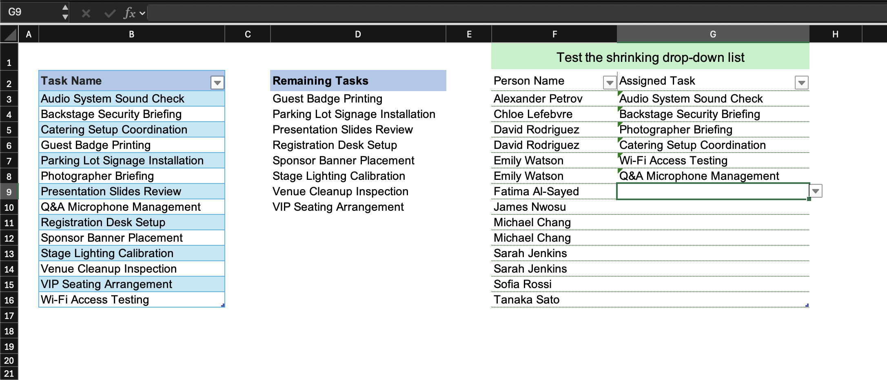
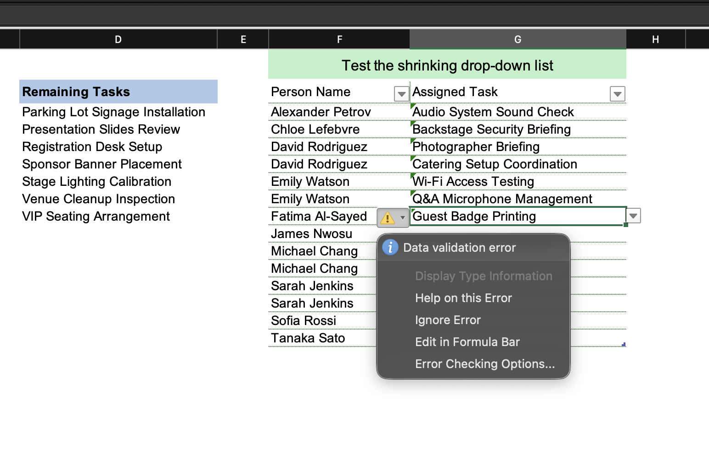

# Shrinking Data Validation Dropdown List

Here I'll show how to build a dropdown list that shrinks as selections are made, once a task is assigned, it disappears from the dropdown so the next person only sees what is still available.

> **Layout note:** In this workbook the source data table, the helper calculation range, and the assignment table sit side by side on the same sheet for clarity. In a real workbook you would keep these on separate sheets.



## Concept

The idea is to have a formula that continuously recalculates the remaining unassigned tasks and spills them into a column. All the assignment dropdowns point to that spilled range, so as more tasks get taken, the column shrinks and every dropdown automatically shows fewer options.

## Step 1 — The Available Tasks formula

In the helper column (Available Tasks), enter this formula:

```excel
=FILTER(TaskTbl[Task Name],
    ISNA(XMATCH(TaskTbl[Task Name], PersonTaskTbl[Assigned Task])),
    "No Tasks Remaining")
```

- `TaskTbl[Task Name]` is the full list of tasks to filter from.
- `ISNA(XMATCH(TaskTbl[Task Name], PersonTaskTbl[Assigned Task]))` is the condition — keep only the tasks that XMATCH cannot find in the Assigned Task column. XMATCH returns a position number when it finds a match and a `#N/A` error when it doesn't, so ISNA converts those `#N/A` errors to TRUE (keep this task) and the found positions to FALSE (exclude it).
- `"No Tasks Remaining"` is returned as a single text value if every task has been assigned.

This formula spills downward and automatically recalculates every time the Assigned Task column changes.

## Step 2 — The assignment dropdown

Select the Assigned Task column and set the Data Validation source to the spilled range from the formula above:

```
=$D$2#
```

The `#` makes this a spill range reference and it always covers all the rows that the FILTER formula currently returns, so the dropdown shrinks automatically without any changes to the validation rule itself.

## What are the green triangles?



Green triangles appear in the top-left corner of the assignment cells after we select a value from the dropdown, and clicking the warning icon next to a cell shows a "Data validation error" message.

These come from Excel's **background error checking**. It continuously monitors cells and flags any cell whose current value is not in its validation source. Because selected tasks are removed from the source the moment they are chosen, every filled cell ends up looking invalid to the error checker — which is technically accurate, but not useful here. The approach is working exactly as intended; this is just Excel noticing the mismatch it is supposed to notice.

We can dismiss the triangle on individual cells by clicking the warning icon and selecting **"Ignore Error"** and it will return if the cell value is edited again.